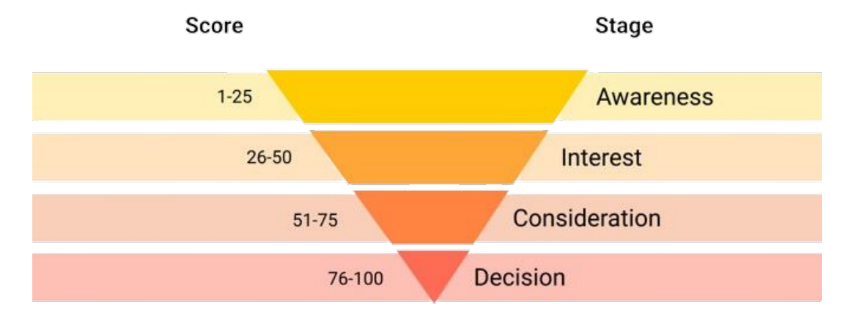

# Lead-Scoring-for-Business-Growth
Lead scoring project using dummy data: 'Education'
## Introduction: Understanding Leads on Business
Before getting into this project there are several things you need to know which I will explain briefly below.

🚀 What is a lead?
A lead is a potential customer who has shown initial interest in your product or service. This could be someone who has visited your product website, signed up for yout email list, or discovered your product or service through social media.

🚀 What is a prospect?
A prospect is a lead who has moved deeper into the sales funnel. They are actively considering your product or service and are evaluating whether it meets their needs. As prospects move closer to making a purchase, nurturing relationships with them becomes critical. Provide valuable and relevant information to help prospects make a decision.

In addition to leads and prospects, the business world is also closely associated with the term customer. They are individuals or companies who have converted by making a purchase and are actively using your product or service.

By nurturing leads into prospects and nurturing strong relationships with customers, businesses can thrive in today’s competitive marketplace.

🚀 What is Leads Scoring?

Lead scoring is the process of assigning a value to each prospect you acquire for your business. This system aims to identify the level of interest and readiness to buy from the prospect. Lead scoring helps the Sales team prioritize the prospects who are most likely to buy the products or services you offer. Basically, this assessment is based on engagement and behavior factors.

Engagement means how actively the prospect interacts with the marketing campaign, such as opening emails, downloading content, attending webinars, or filling out forms. The higher the engagement, the more likely they are to be interested in your product/service. While behavior relates to whether the prospect asks for product details, looks for a demo or signs up for a free trial. These actions indicate a deeper interest than just visiting your website.

Leads with high scores are considered more ready to be followed up by the Sales team, while Leads with low scores may still need further nurturing or education from the marketing team.

Lead scoring Models are influenced by various factors, such as Demographics information, Company information, Online behavior, Email engagement, Social engagement, and Spam detection.

Lead scoring will help you determine what stage a prospect is at in the sales cycle, this relates to how likely the prospect is to convert and helps you make more informed decisions about whether or not you need to take further action.

There are several methods that can be used to perform Lead Scoring, including:
- Rule-Based Scoring → Leads are scored based on manual rules (for example, each website visit = +5 points).
- Machine Learning-Based Scoring → Predictive models are used to score leads based on patterns in historical data.

In this project, we use Machine Learning (Random Forest, Logistic Regression, etc.) to make predictions based on historical patterns of customer conversions.

# Framework Analysis
## Business Problem
Education Company is a business that sells online courses to industry professionals. Every day, many individuals interested in their courses visit the company's website to search for information, fill out forms, or watch videos. When someone submits a form with their email or phone number, they are classified as a lead. The company also obtains leads from previous referrals. Once a lead is acquired, the sales team initiates engagement by reaching out through phone calls or emails. While some of these leads eventually convert into customers, the majority do not.

To connect with potential customers, the company has a dedicated sales team responsible for marketing activities. The HDA team employs various approaches to engage with leads, explain the courses, and address any questions they may have. The sales team has a KPI target to achieve a conversion rate of 80%. However, despite having a large number of website visitors, the team faces challenges in converting leads. Currently, only 30% of leads successfully turn into paying customers, far below the expected 80% target set by the sales team.

Given the high volume of incoming leads, the sales team struggles to effectively prioritize potential customers, resulting in wasted time and resources pursuing leads with no serious interest in their products. Without a clear strategy to evaluate and prioritize high-quality leads, the effectiveness of marketing and sales efforts diminishes, ultimately reducing the company's profitability.

## Analysis Objective 
The objective of this analysis is to develop a Lead Scoring model that can identify and prioritize leads with a high probability of conversion, enabling the sales team to focus on the most promising prospects. This analysis aims to:

✅ Increase the lead conversion rate from 30% to the target of 80% set by the sales team.
✅ Optimize the allocation of sales team resources, ensuring they concentrate on high-potential leads (those with a high lead score) rather than spending time on low-quality prospects.
✅ Enhance marketing efficiency by providing deeper insights into potential customers' behavioral patterns, allowing for more targeted and effective marketing strategies.
✅ Determine the probability score for each lead, enabling more precise and data-driven business decision-making.

## Key Questions
To achieve the objectives of this analysis, several key questions need to be addressed in the Lead Scoring process:

🔹 What factors influence a lead's likelihood of conversion?
🔹 What behavioral patterns do high-converting customers exhibit?
🔹 Do specific attributes—such as lead source, visit duration, or website engagement—contribute to conversion probability?
🔹 How can predictive modeling provide an accurate lead score based on past conversion patterns?
🔹 What are the best strategies for the sales team to leverage Lead Scoring to improve efficiency?

## Data Findings:
1. Based on Feature Importance from the Tuned Random Forest model, the 3 factors that most determine conversion are:
- Tags_Will revert after reading the email (0.431511) → Response to email is the main factor in determining whether a lead will convert.
- Total Time Spent on Website (0.132706) → Leads who spend more time on the website have a higher probability of converting.
- Lead Origin_Lead Add Form (0.091594) → Leads from this form are more likely to become customers than leads from other sources.

2. Based on the analysis of the conversion rate distribution, several customer behavior patterns were found:
- Leads who explicitly respond to emails are more likely to become customers → They show high engagement with the company and are more active in communication.
- Leads with a long visit time on the website are more likely to convert → This shows that the longer customers explore information, the more likely they are to make a purchase.
- Leads who last interacted via SMS have a high conversion rate → This shows that the SMS follow-up strategy is more effective than just using email or retargeting ads.

3. Based on the evaluation of the distribution of conversion rates and correlations between features, it was found that several attributes have a major impact on conversion opportunities:
1) Lead source has a significant impact →
- Leads from Reference have a conversion rate of 91.7%, but the number is still low.
- Leads from Welingak Website also have a high conversion rate (98.6%), but just like Reference, the number is not much.
- Leads from Google have the largest number but a lower conversion rate (40.4%).
2) The duration of the visit is related to the conversion rate → The longer the leads stay on the website, the higher the probability of them converting into customers.
3) Page Views Per Visit has a smaller effect on conversion, but still shows that leads who view more pages tend to have a higher interest in the product.

The source of the lead, duration of the visit, and engagement with the website have a significant impact on the chances of customer conversion. Focusing on high-quality lead sources and improving website engagement strategies can increase conversions.

4. Evaluating the Machine Learning model, we found that Random Forest Tuned has the best accuracy in predicting customer conversions with ROC-AUC and F1 of 92.34% and 90.88%. We have achieved a precision target of more than 80%, which is 92.89% of the 30% conversion rate.

5. From the results of the Lead Score model evaluation and segmentation, some of the best strategies for the sales team are:
1) Use the Lead Score category as a basis for determining customer approach strategies:
- Awareness (1-25%) → Focus on retargeting and education, because they are still in the information seeking stage.
- Interest (25-50%) → Send nurturing emails with course information and customer testimonials to increase engagement.
- Consideration (50-75%) → Provide discounts or interactive webinars to accelerate their decisions.
- Decision (75-100%) → Use urgency strategy (limited promo, direct follow-up from sales team) to increase conversion.
2) Strengthen communication via SMS, because it has been proven to have a higher conversion rate compared to just using email or website.
3) Optimize lead sources that have high conversion rates such as Reference and Welingak Website with a more aggressive marketing strategy.

## Implications:
1. Companies need to optimize their email marketing strategy because it has a big impact on customer decisions.
2. Lead sources from Reference and Welingak Website need to be improved with SEO strategies, referral programs, and targeted advertising.
3. Direct communication strategies via SMS need to be strengthened, because they have proven to be more effective in increasing conversions.
4. Leads who only view website pages without further interaction need to be targeted with retargeting campaigns to enter the next stage.
5. Using Lead Category segmentation allows the sales team to be more efficient in approaching customers, with communication strategies that are tailored based on their readiness to buy.
6. Companies can implement personalized marketing for each category, so that campaigns are more targeted and conversions are more optimal.
